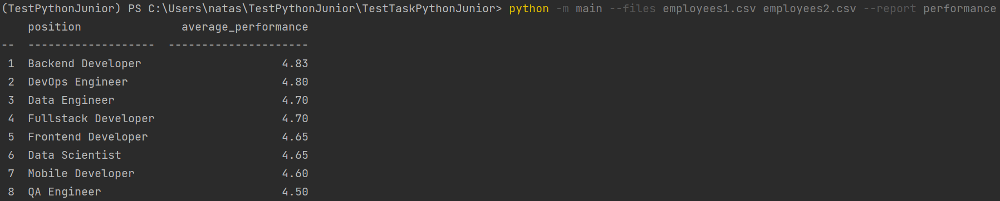
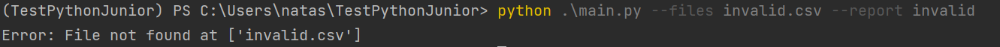
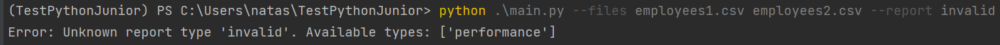
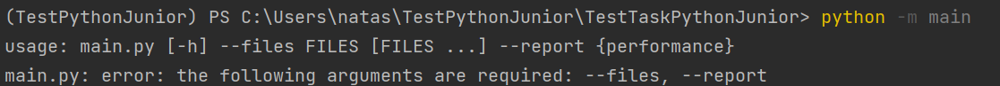
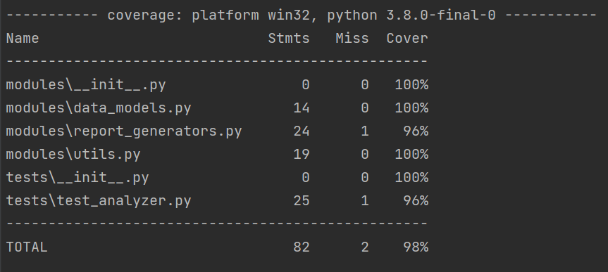
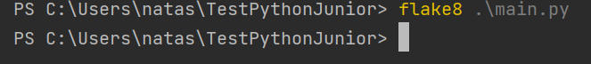

# Анализ эффективности работы разработчиков

### Скрипт читает файлы с данными переданных в качестве аргумента параметра --files
### Скрипт формирует отчет переданный в качестве аргумента параметра --report

Для добавления новых видов отчетов, нужно добавить этот вид отчета в словарь 
report_handlers в функции display_report, в качестве значения ключа указать 
название функции собирающий новый отчет из "сырых" данных

## Примеры запуска скрипта:
>Пример валидного запуска скрипта

> Запуск с несуществующим файлом

> Запуск с несуществующим отчетом

> Запуск без параметров

> Отчет тестирования покрытия

> Отчет линтера flake8
